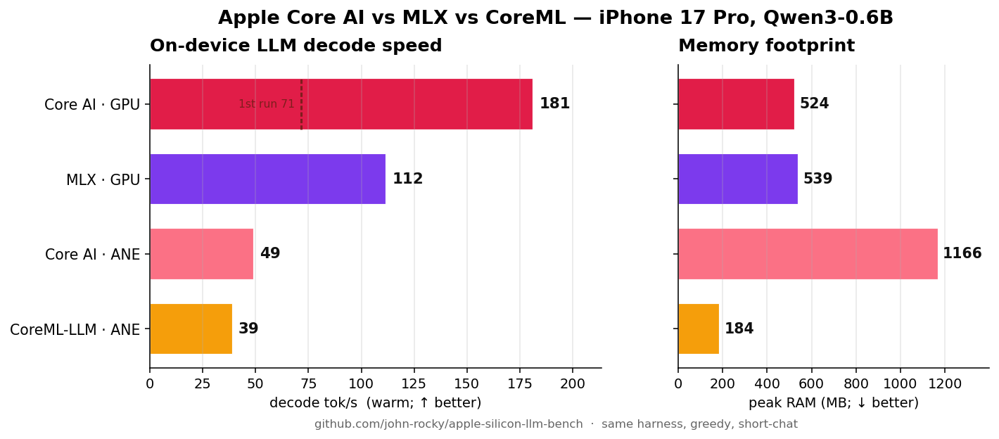
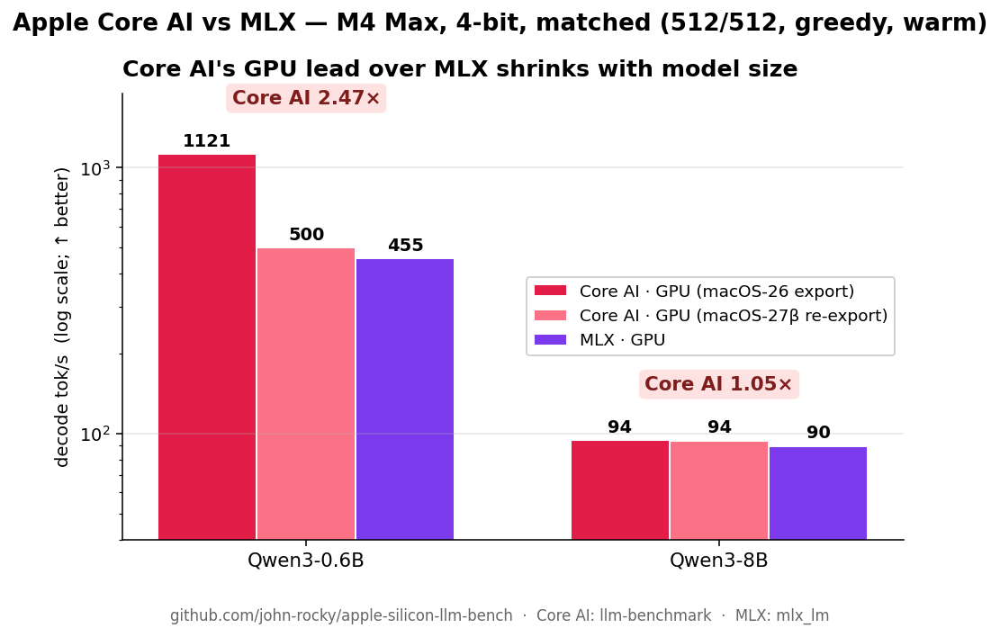

# Apple Silicon LLM Benchmark

**On-device LLM benchmark for Apple Silicon — iPhone · iPad · Mac.**

A neutral, reproducible benchmark for running local LLMs (and, in time, ASR / TTS) on Apple Silicon. Compares **MLX Swift, llama.cpp, CoreML (swift-transformers), LiteRT-LM, ExecuTorch, ANEMLL, Apple Core AI** — and Apple's own Foundation Models — under real device constraints, not just `tok/s` on a server.

> Repo: `apple-silicon-llm-bench` · CLI/brand: `yardstick`. Started life as `ios-llm-benchmark` — iPhone is still the headline target, now measured alongside iPad and Mac.

---

## ⚡ NEW — Apple **Core AI** benchmarked (the Core ML successor)

[Core AI](https://developer.apple.com/documentation/coreai) is Apple's Core ML successor, announced at WWDC 2026 (iOS / macOS 27). First independent on-device LLM benchmark — vs MLX and CoreML, **same model, same harness**.



**iPhone 17 Pro · Qwen3-0.6B · short-chat · warm decode (median):**

| Engine | Compute | Decode tok/s | Peak RAM |
|---|---|---:|---:|
| **Core AI** (pipelined) | GPU | **181** 🏆 _(1st run 71)_ | 524 MB |
| MLX | GPU | 112 | 539 MB |
| **Core AI** (static-shape) | ANE | 49 | 1,166 MB |
| **CoreML-LLM** | ANE | 39 | **184** 🏆 |

- **Core AI's GPU "pipelined" engine is the fastest on-device path here — ~1.6× MLX — once warm.** It pays a one-time first-run cost (kernel compilation + filling a 3-deep pipeline): ~71 tok/s on the very first generation, then ~181 steady-state. MLX is flat cold-to-warm.
- **Core AI's compute unit is fixed by the *export shape*, not a runtime flag:** `coreai.llm.export … --platform iOS` (static) is detected as chunked-static → the **ANE**; a dynamic export → the **GPU** pipelined engine. And iOS can't JIT the exported IR — it must be `coreai-build compile`-d to a per-GPU-arch `.aimodelc` first (`No such file or directory` otherwise).
- **CoreML-LLM is the memory champion** — 184 MB, ~6× leaner than Core AI's ANE path — via a stateful INT4 Neural-Engine conversion (own work, 100% ANE residency).
- Faithful to Apple's intended path: official `coreai.llm.export` + the `coreai-models` `CoreAILM` runtime, driven by the in-tree [`CoreAIRuntime`](ios/BenchmarkApp/Sources/Runtimes/CoreAIRuntime.swift). Method + gotchas: [`methodology/coreai-ios.md`](methodology/coreai-ios.md).

**Does the GPU lead hold at scale? (Mac M4 Max, same params)**



| Model (4-bit) | Core AI GPU | MLX | Core AI lead |
|---|---:|---:|---:|
| Qwen3-0.6B (macOS-26 export) | 1,121 | 455 | **2.47×** |
| Qwen3-0.6B (macOS-27β re-export) | ~500 | 455 | **1.1×** |
| Qwen3-8B | 94 | 90 | **1.05×** |

Core AI's pipelined-GPU lead is large on **tiny** models — where its async-dispatch / overlap dominates — but **converges to a near-tie at a realistic 8B**, where both runtimes become memory-bandwidth-bound. _(Matched: 512-token prompt, 512 gen, greedy, warm. Core AI via Apple's `llm-benchmark`; MLX via `mlx_lm`.)_

> ⚠️ **The 0.6B number is export-generation-dependent.** The same `coreai.llm.export`
> recipe produces a 2.2× slower artifact after the macOS 27 beta upgrade (native
> quantized-Linear lowering → explicit dequant ops; same runtime, same code, same
> wheels). Forensics: [`methodology/coreai-export-lowering.md`](methodology/coreai-export-lowering.md).
> Benchmark the artifact you ship.
>
> **Confirmed on iPhone 17 Pro** (both artifacts AOT-compiled `--architecture h18p`,
> GPU, synthetic 512p/1024g — deeper-KV protocol, NOT comparable to the short-chat
> table above): macOS-26 artifact **115.1 tok/s** decode / 5,807 prefill / 0.22 GB
> footprint vs 27β artifact 57.2 / 1,519 / 0.47 GB — **~2× decode, 3.8× prefill,
> half the memory, from the export environment alone.** ANE (official iOS static
> preset, same protocol): 69.6 tok/s, 0.045 s warm load.

**Full official-recipe matrix (M4 Max, macOS 27β artifacts, `llm-benchmark` defaults 512p/1024g/5):**

| Model | Artifact | Core AI decode (prefill) | MLX 0.31.3 decode (prefill) | Decode verdict |
|---|---|---:|---:|---|
| gpt-oss-20b (MoE, MXFP4) | 13 GB | 78.1 (1,252) | **100.2** (1,528) | **MLX +28%** |
| qwen3-0.6b | 335 MB | **484** (9,396) | 432 (9,366) | **Core AI +12%** |
| qwen3-4b | 2.1 GB | 145.4 (**1,635**) | 145.8 (1,495) | tie |
| qwen3-8b | 4.3 GB | **94.1** (912) | 90.0 (825) | **Core AI +5%** |
| gemma3-4b-it | 2.1 GB | **141.5** (1,669) | 136.3 (1,631) | **Core AI +4%** |
| gemma3-12b-it | 6.2 GB | 55.0 (**578**) | 55.1 (528) | tie |
| mistral-7b-v0.3 | 3.8 GB | **101.7** (976) | 97.5 (918) | **Core AI +4%** |

**Core AI matches or beats MLX on every dense model; MLX's one clear win is the MoE**
(expert dispatch, not the core engine). gpt-oss-20b bonus: `COREAI_CHUNK_THRESHOLD` is a
memory dial — unchunked 4096-token prefill hits 1,439 tok/s (+16%) at 18 GB dirty
footprint, chunk-128 (the `llm-runner` MoE hint) caps memory at 1.7 GB for 766 tok/s.
Raw logs + env pins: [`results/raw/2026-06-11-m4max-coreai-matrix/`](results/raw/2026-06-11-m4max-coreai-matrix/).

---

## 📱 TL;DR — iPhone 17 Pro (A19 Pro)

Real LLM inference on a phone — on-device, no server. iPhone 17 Pro, 4-bit, short-chat (128 tokens), median of 3 cold runs. **The winning runtime is model-dependent — and the upset is on Gemma.**


**Decode throughput** — tok/s, higher is better (🏆 = winner):

| Model (4-bit, n=3) | 🔴 LiteRT-LM | 🟣 MLX-Swift | 🔵 llama.cpp | 🟠 CoreML/ANE |
|---|---:|---:|---:|---:|
| Gemma 4 E2B | **55.4** 🏆 | 47.5 | 37.8 | 33.4 |
| Qwen 3.5 2B | — | **61.2** 🏆 | 39.1 | 27.9 |

**Peak memory** — MB, lower is better (🏆 = winner):

| Model (4-bit, n=3) | 🔴 LiteRT-LM | 🟣 MLX-Swift | 🔵 llama.cpp | 🟠 CoreML/ANE |
|---|---:|---:|---:|---:|
| Gemma 4 E2B | **641** 🏆 | 2,900 | 3,156 | 1,187 |
| Qwen 3.5 2B | — | 1,279 | 1,479 | **241** 🏆 |

- **The upset — Gemma 4 E2B:** Google's **LiteRT-LM** (INT4-QAT, GPU, its native `.litertlm`) beats MLX-Swift on decode **and** uses ~4.5× less memory (641 MB vs 2,900). The purpose-built runtime wins on its own format.
- **MLX-Swift wins Qwen 3.5 2B decode** — 61 vs 39 tok/s. (LiteRT-LM has no Qwen entry — its catalog is Gemma-only.)
- **CoreML / ANE is the memory champion** — Qwen 3.5 2B in just **241 MB** (~5× leaner than MLX's 1,279) via chunked-MLKV on the Neural Engine — but it's the **slowest decode** (ANE trades throughput for footprint), same story as on M4 Max.
- **ANE is near-parity with the desktop:** CoreML Gemma 4 E2B does 33 tok/s on iPhone vs 32.5 on M4 Max — same silicon family. The **GPU** runtimes pay the real on-device tax: ~4–5× slower than M4 Max (Qwen 3.5 2B → 61 tok/s vs 292).
- **Counting:** MLX / llama.cpp / LiteRT-LM report exact tokenizer tokens (LiteRT-LM via `getBenchmarkInfo`); CoreML/ANE counts streamed pieces (≈ tokens). LiteRT-LM runs to EOS (no per-call cap → ~458-tok reply vs the others' 128 budget); decode tok/s is a rate, so the head-to-head holds.
- **Fully automated, side-loaded** via `devicectl` headless mode — nothing typed on the phone, same methodology as the desktop rows.
- **Coming next:** Apple Foundation Models, more models and more iPhones / iPads. [One row is a great PR](CONTRIBUTING.md).

> **How the LiteRT-LM row was measured:** `google-ai-edge/LiteRT-LM` 0.12.0 running `litert-community/gemma-4-E2B-it.litertlm` (INT4-QAT) on the Metal **GPU** backend, via the in-tree [`MediaPipeRuntime`](ios/BenchmarkApp/Sources/Runtimes/MediaPipeRuntime.swift) adapter — same headless harness + prompt as every other row (3 cold runs, median). Token counts and tok/s come from **LiteRT-LM's own benchmark counters** (`Conversation.getBenchmarkInfo`), so they're exact, not estimated. It generates to EOS (no per-call output cap in the API), so its token count is the model's full reply rather than the 128-token budget — decode tok/s is a rate and stays comparable; memory is exact process RSS. LiteRT-LM is vendored as a **local SwiftPM package** (`scripts/bootstrap.sh` clones it with `GIT_LFS_SKIP_SMUDGE=1`; the released package trips SwiftPM's unsafe-flags rule via its `-all_load`).
>
> **How the CoreML/ANE rows were measured:** `john-rocky/CoreML-LLM` on the Neural Engine (`computeUnits: .cpuAndNeuralEngine`) — Gemma 4 E2B via the chunked `.mlmodelc` path, Qwen 3.5 2B via `Qwen35MLKVGenerator` (chunked MLKV, hence the 241 MB). Decode counts streamed pieces (≈ tokens); first-load ANE compilation makes its load time high (and it's the lowest-throughput runtime — the ANE trades speed for memory).
>
> Decode tok/s is the headline number; the full per-run audit (prefill, TTFT, inter-token jitter, memory) lives in [`RESULTS.md`](RESULTS.md).

---

## ⏱ Burst tok/s is only half the story — sustained throttling

The table above is **cold-burst** speed. Run the same model **continuously** and it flips: the GPU runtimes (MLX, LiteRT-LM) heat up and throttle **50%+ within ~60 s**, while the **ANE barely moves** — it draws ~half the power, so it heats slowly and the SoC doesn't throttle it.


| Gemma 4 E2B, iPhone 17 Pro | Burst tok/s | Sustained (10 min) | Retained |
|---|---:|---:|---:|
| **CoreML / ANE** | 33 | **22** | **67%** |
| MLX / GPU | 48 | 18 | 38% |
| LiteRT-LM / GPU | 56 | 27 | 48% |

Two **independent** GPU runtimes collapsing the same way is a GPU-thermal property of the phone, not a runtime quirk. MLX ends up *below* the ANE; LiteRT keeps only a slim lead after shedding half its speed. **The GPU wins the sprint; the ANE wins the marathon** — and it frees the GPU for the rest of the app.

> Method: 600 s continuous generation, cold (`nominal`) start, unplugged, tg128; decode rate from a rolling window. Raw JSONL in `results/raw/iphone17pro-*-energy-tg128.jsonl`; redraw with [`scripts/throttle_chart.py`](scripts/throttle_chart.py) (curves table via [`scripts/throttle_curve.py`](scripts/throttle_curve.py)). LiteRT-LM has no output-token cap (longer per-call) and that run started at `fair` thermal; CoreML-LLM uses sliding-window attention (bounded context), part of why its decode stays flat.

---

## 🎥 Live-camera VLM — the same throttle story, now on vision (new)

The throttle section above is text decode. The next axis runs a **vision-language
model on the live camera, continuously for 10 minutes** — the workload an
always-on "point the phone at the world" feature actually is — and asks the same
question: **does the GPU melt while the ANE holds?**

Same phone, same scene, **Qwen3-VL 2B** on both paths (both run today):

- **GPU** — `MLXVLMRuntime` (MLX/Metal), `mlx-community/Qwen3-VL-2B-Instruct-4bit`.
- **ANE** — `CoreMLVLMRuntime` (CoreML, `.cpuAndNeuralEngine`) driving
  `john-rocky/CoreML-LLM`'s real Qwen3-VL pipeline (vision encoder → chunked
  INT8 decoder), model `mlboydaisuke/qwen3-vl-2b-coreml`.

The app gains a **Camera** tab: pick the backend, point it at a dense scene, hit
Start. The HUD overlays **sustained FPS, thermal state, battery, ANE residency**
live (it doubles as the screen-record surface for the demo clip). Each session
logs sustained FPS, per-inference TTFT, ANE residency (`MLComputePlan`), peak
thermal and whole-system power, plus the FPS-and-heat time series the chart is
drawn from:

```sh
# Camera tab → backend → 10 min → Start (run once per backend, same scene)
python3 scripts/vlm_throttle_chart.py     # → docs/charts/vlm-camera-throttle.png
```

Method, fairness rules, the ANE-residency measurement, and the clip protocol:
[`methodology/vlm-camera-ios.md`](methodology/vlm-camera-ios.md). Numbers land
once the runs are captured on device — [a paired ANE/GPU session is a great PR](CONTRIBUTING.md).

---

## 🖥 Desktop reference — Apple M4 Max

The same harness on a laptop-class chip, for scale. No runtime wins everything here — each optimises a different corner of the throughput / memory / energy / streaming box:


- **mlx-swift** wins decode throughput on every cell measured (1.4×–1.8× over llama.cpp after early-2026 kernel updates).
- **Apple Foundation Models** is 2× more energy-efficient per token than the GPU-backed runtimes, 4× more than CoreML/ANE.
- **CoreML / ANE** wins peak memory (chunked MLKV) but is the slowest *and* the worst on J/token.
- **llama.cpp** sits in the middle on speed and energy — no axis it wins, no axis it loses badly.

| | |
|---|---|
|  |  |
|  | _Tables for the exact numbers live below._ |

Regenerate after adding rows: `python scripts/generate_charts.py`.

---

## 📊 Full numbers — Apple M4 Max, short-chat (128 tokens, decode tok/s, median)

> One device, four runtimes, multiple models. Decode tok/s is the primary headline number; the full table (prefill, TTFT, peak memory, per-run audit trail) lives in [`RESULTS.md`](RESULTS.md). Read the [Headline observations](RESULTS.md#headline-observations-read-this-after-the-tables) section before drawing conclusions — the runtime ranking is **model-size-dependent**.

### Cross-runtime — same logical model, different backends (decode tok/s, median)

| Logical model | Params | n | mlx-swift (Q4) | llama.cpp (Q4_K_M) | coreml-llm | litert-lm (.litertlm) |
|---|---:|---:|---:|---:|---:|---:|
| Qwen 2.5 0.5B | 0.5 B | 3 | **531.1** | 297.1 | 181.2 (FP16) | n/a |
| Qwen 3.5 0.8B | 0.8 B | 3 | **421.1** | 201.1 | 58.2 (INT8) | n/a |
| Qwen 3.5 2B   | 2 B   | 3 | **291.9** | 149.7 | 35.0 (INT8) | n/a |
| Gemma 4 E2B   | 2 B   | 3 | **185.4** | 119.2 | 32.5 (INT4 palettized) | _pending_ |
| Gemma 4 E4B   | 4 B   | 3 | **113.5** | 80.5 | _not run_ | _pending_ |

> `litert-lm` column: **_pending_** = adapter wired against `google-ai-edge/LiteRT-LM` v0.12.0, M4 Max run not yet captured (see [`RESULTS.md`](RESULTS.md) / `Yardstick_USER_RUNS.md`). **n/a** = LiteRT-LM's catalog is Gemma-only (`.litertlm`), so the Qwen rows have no entry. For reference, Google's E2B model card reports 56.5 tok/s on iPhone 17 Pro GPU — a vendor figure on a different device, not an M4 Max Yardstick measurement.

→ **MLX-Swift now wins decode on every cell** — 1.4×–1.8× over llama.cpp — after upstream `mlx-swift-lm` shipped Qwen + Gemma kernel updates in early 2026 (the Qwen rows roughly tripled vs. the snapshot captured before those landed). The old "llama.cpp Metal always wins small-model decode" rule is no longer true on M4 Max; re-measure before quoting it. CoreML / ANE is the slowest of the three on every cell, in exchange for the dramatic memory savings shown below.

### Cross-runtime — peak memory (MB, median)

The decode-tok/s table above hides the memory side. Same models, looking at peak working-set instead:

| Logical model | Params | mlx-swift | llama.cpp | coreml-llm | litert-lm |
|---|---:|---:|---:|---:|---:|
| Qwen 2.5 0.5B | 0.5 B | **390** | 538 | 962 | n/a |
| Qwen 3.5 0.8B | 0.8 B | **600** | 752 | 221 (INT8) | n/a |
| Qwen 3.5 2B   | 2 B   | 1223 | 1443 | **230** (INT8) | n/a |
| Gemma 4 E2B   | 2 B   | 2829 | 3212 | **1036** | _pending_ |
| Gemma 4 E4B   | 4 B   | **4376** | 5150 | — | _pending_ |

→ **"CoreML/ANE wins memory" is true once the chunked MLKV layout kicks in.** At 0.5 B params MLX-Swift is still smaller (413 MB vs CoreML's 959 MB monolithic FP16); from 0.8 B onward, CoreML's chunked MLKV path (`Qwen35MLKVGenerator`: mmap'd embed sidecar + on-demand ANE chunks) holds the process RSS roughly flat — 206 MB at 0.8 B, 215 MB at 2 B — while MLX and llama.cpp scale linearly with parameter count.

### Cross-runtime — energy per token (Gemma 4 E2B, sustained-512, M4 Max)

The number nobody else publishes: how many joules does each backend burn per generated token? Captured via [`scripts/measure_energy.py`](scripts/measure_energy.py) which co-runs `powermetrics` (whole-system, package power = CPU + GPU + ANE) and clips the sample window to the bench's reported active time.


The ANE path draws **~half** the GPU path's package power at full decode (12.7 W vs ~24.7 W) — the same power gap that makes the GPU runtimes thermally throttle on iPhone while the ANE holds its rate (see the sustained-throttle section above).

| Runtime | Avg pkg power (W) | Energy / 512-tok run (J) | **J / token** |
|---|---:|---:|---:|
| **apple-fm** (system model) | 7.6  | 67.4  | **0.11** |
| mlx-swift (4-bit MLX) | 24.7 | 123.0 | 0.24 |
| llama.cpp (Q4_K_M, GGUF) | 24.5 | 126.3 | 0.25 |
| coreml-llm (INT4 palettized, ANE) | 12.7 | 244.9 | 0.48 |

→ **Energy ranking inverts the decode-tok/s ranking.** Apple FM is 2× more efficient per token than the GPU-backed runtimes despite producing tokens at ~half the rate. CoreML/ANE has the lowest *instantaneous* power (12.7 W) but is the *worst* J/tok at 4× Apple FM, because the slower decode (32 tok/s) keeps the package powered up much longer. MLX-Swift and llama.cpp draw the most W (GPU) but produce tokens fast enough to break even at ~0.24 J/tok. Whole-system measurement includes the idle baseline so all four numbers slightly inflate per-token energy — useful for ranking, not for absolute attribution. iPhone energy uses the 1 %-battery-step API instead (different methodology, similar table shape).

### Per-runtime model scaling

<sub>**llama.cpp** (Q4_K_M GGUF, M4 Max, short-chat)</sub>

| Model | Params | n | TTFT (ms) | Decode tok/s | Peak Mem (MB) |
|---|---:|---:|---:|---:|---:|
| Qwen 2.5 0.5B | 0.5 B | 3 | 22  | 297.1 | 538 |
| Qwen 3.5 0.8B | 0.8 B | 3 | 22  | 201.1 | 752 |
| Llama 3.2 1B  | 1.0 B | 3 | 25  | **285.9** | 1022 |
| Qwen 3.5 2B   | 2 B   | 3 | 29  | 149.7 | 1443 |
| Gemma 4 E2B   | 2 B   | 3 | 41  | 119.2 | 3212 |
| Gemma 4 E4B   | 4 B   | 3 | 62  | 80.5  | 5150 |

<sub>**mlx-swift** (Q4 / MLX, M4 Max, short-chat)</sub>

| Model | Params | n | TTFT (ms) | Decode tok/s | Peak Mem (MB) |
|---|---:|---:|---:|---:|---:|
| Qwen 2.5 0.5B | 0.5 B | 3 | 21  | **531.1** | 390 |
| Qwen 3.5 0.8B | 0.8 B | 3 | 36  | **421.1** | 600 |
| Qwen 3.5 2B   | 2 B   | 3 | 42  | **291.9** | 1223 |
| Gemma 4 E2B   | 2 B   | 3 | 68  | 185.4     | 2829 |
| Gemma 4 E4B   | 4 B   | 3 | 90  | 113.5     | 4376 |

<sub>**coreml-llm** (CoreML / ANE, M4 Max, short-chat)</sub>

| Model | Params | n | TTFT (ms) | Decode tok/s | Peak Mem (MB) |
|---|---:|---:|---:|---:|---:|
| LFM 2.5 350M  | 0.35 B | 1 | 383 | 58.9  | **98**  |
| Qwen 2.5 0.5B | 0.5 B  | 3 | 171 | 181.2 | 962     |
| Qwen 3.5 0.8B | 0.8 B  | 3 | 405 | 58.2  | **221** |
| Qwen 3.5 2B   | 2 B    | 3 | 665 | 35.0  | **230** |
| Gemma 4 E2B   | 2 B    | 3 | 525 | 32.5  | 1036    |

→ CoreML/ANE trades throughput for memory: 3-8× less peak working set than MLX-Swift / llama.cpp at the same model size, at ~half the decode tok/s. The Qwen 3.5 0.8B / 2B numbers come from the dedicated `Qwen35MLKVGenerator` (ANE chunked decode, KV in `MLState` — public API since CoreML-LLM `v1.9.0`), not the generic `CoreMLLLM.load(from:)` path.

### Apple Foundation Models (system, on-device — reference row)

Apple FM is a single pre-installed model, so it can't share a "logical model" row with the open-weight runtimes above. It earns its own line as a reference point — the number to beat when "just use the system model" is the alternative.

| Runtime | Model | n | TTFT (ms) | Decode tok/s | Peak Mem (MB, in-process) |
|---|---|---:|---:|---:|---:|
| apple-fm | Apple Foundation Model (default, ~3 B params est.) | 3 | 269 | 85.2 | 27 |

**Caveats — read before comparing.**

- **Tokens are estimated** (`utf8.count / 4`) because `FoundationModels` does not expose the tokenizer. Treat decode tok/s as ±20%; the other runtimes report counts from their actual tokenizer.
- **Peak memory is in-process only.** The model lives in Apple's system process, not ours, so 27 MB is the harness overhead — not the true model footprint. Use Activity Monitor / `powermetrics` for the system-wide picture.
- **Quant is Apple-internal.** Community reverse-engineering puts it at ~2-bit base weights + 4-bit task adapters; Apple has not published numbers. Don't read the decode tok/s as a comment on any specific quant choice.

**[Full results — by model, by runtime, full per-run audit trail →](RESULTS.md)**

---

## 🙋 Contributing a row

This table is the repo. **The easiest possible contribution is one new row.** All three of these are equally valuable:

1. **A new device.** Run the existing models on your iPhone / iPad / Mac. Tooling in [`Yardstick_USER_RUNS.md`](../Yardstick_USER_RUNS.md). The "Devices wanted" list at the bottom of [`RESULTS.md`](RESULTS.md#devices-wanted) is the shortlist.
2. **A new model.** Drop the model id into the [`ModelCatalog`](ios/BenchmarkApp/Sources/Models/ModelCatalog.swift) for the runtime that can load it.
3. **A new runtime.** Wire it up in [`ios/BenchmarkApp/Sources/Runtimes/`](ios/BenchmarkApp/Sources/Runtimes/) following the `LLMRuntime` protocol; the harness will pick it up.

Workflow once you have the build set up:

```sh
# 1. Run 3 times to get a stable median:
for run in 1 2 3; do
  yardstick run --task short-chat \
                --runtime mlx-swift \
                --model <id-or-hf-repo> \
                --output results/raw/<device>-<runtime>-<model>-short-chat-run${run}.jsonl
done

# 2. Regenerate the tables — they're auto-built from JSONL:
python scripts/render_results.py

# 3. Commit the JSONLs + the updated RESULTS.md, open a PR.
```

CI runs `python scripts/render_results.py --check` on every PR — it fails if the JSONLs and the tables disagree, so the human-edited section of RESULTS.md cannot drift out of sync with the raw data.

Full step-by-step (build, model picker, device-specific gotchas) lives in [`CONTRIBUTING.md`](CONTRIBUTING.md).

---

## What gets measured

Per `(runtime, model, device, build)` tuple:

- **Speed** — TTFT, prefill `tok/s`, decode `tok/s`, sustained-decode drift over 512+ tokens.
- **Memory** — baseline, peak during decode, after-generation.
- **Thermal** — initial / peak / final state across the run.
- **Jitter** — inter-token latency `p50` / `p95` / `p99` ms, captured from the gap between consecutive `.chunk` events. Surfaces the worst-case stall a chat UI will perceive even when the average decode rate looks smooth.
- **Energy** — joules per token. iOS uses the 1%-battery-step API; Mac uses `scripts/measure_energy.py` (wraps `powermetrics`, see "Optional: capture Mac energy" below).
- **Lifecycle** — survives background → foreground, cancellation latency, streaming.
- **Quality** *(roadmap)* — WER / CER for ASR, perplexity / MMLU for LLM, byte-identical comparison vs Python references.

Methodology lives under [`methodology/`](methodology/). The numbers we publish follow [`methodology/fairness-rules.md`](methodology/fairness-rules.md).

### Optional: capture Mac energy with `powermetrics`

```sh
sudo python scripts/measure_energy.py run \
     --task short-chat --runtime mlx-swift \
     --model mlx-community/gemma-4-e2b-it-4bit \
     --output results/raw/<device>-<runtime>-<model>-<task>-energy.jsonl
```

The wrapper starts `powermetrics` in the background, runs `yardstick`,
stops `powermetrics`, then patches the JSONL with `energyJoules`,
`averagePackagePowerW`, and `energyJoulesPerToken`. Numbers are
whole-system — run on an idle desktop and use them to compare
runtimes on the same Mac, not Macs to each other.

### Optional: import iPhone / iPad runs

The iOS app's **History → ••• → Export all (JSONL)** sheet hands you a
single newline-delimited file. AirDrop it to your Mac, then:

```sh
python scripts/import_ios_export.py ~/Downloads/yardstick-*.jsonl
python scripts/render_results.py
```

The import script splits the bundle into one
`results/raw/<device>-<runtime>-<model>-<task>-runN.jsonl` per row,
re-keying the device label so `render_results.py` recognises it.

## Project shape

```
Yardstick/
├── Package.swift              SPM: YardstickKit library + `yardstick` Mac CLI
├── apple/
│   └── YardstickCLI/          Mac command-line runner
├── ios/
│   └── BenchmarkApp/          On-device iOS app (`.xcodeproj`)
├── runtimes/                  Per-runtime notes (adapters, gotchas, version pins)
├── devices/                   Per-device pages (chip, RAM, OS, build, signing)
├── methodology/               How we measure each axis fairly
├── models/                    Curated model catalog
├── prompts/                   Standardized prompts per task
└── results/
    ├── raw/                   JSONL dumps per run
    └── (summary tables generated into RESULTS.md)
```

## Running on Mac (CLI)

> **Current status (May 2026)**: SPM build is clean. Runtime is blocked by [`ml-explore/mlx-swift#349`](https://github.com/ml-explore/mlx-swift/issues/349) — the MLX Metal kernel bundle isn't emitted by `swift build` from a downstream package, so `swift run yardstick run …` exits with `Failed to load the default metallib`. The same workaround applies to `mlx-swift-examples/llm-tool` (its README says "Build the llm-tool scheme in Xcode"). A macOS app target that wraps the CLI through Xcode's Metal toolchain is queued as Phase 2.

When the Phase-2 macOS target lands, this is the intended shape:

```sh
$ yardstick list
$ yardstick run --task short-chat \
                --runtime mlx-swift \
                --model mlx-community/Qwen3-0.6B-4bit \
                --output results/raw/m4max-mlx-qwen3-0.6b.jsonl
```

For now, build verification only:

```sh
$ swift build       # Build complete!
```

## Running on iPhone (app)

```sh
cd ios/BenchmarkApp
./scripts/bootstrap.sh           # downloads llama.xcframework + Anemll source
open BenchmarkApp.xcodeproj      # set your Team in Signing & Capabilities
                                 # ⌘R on a connected iPhone
```

First launch downloads the chosen model (default: `mlx-community/gemma-4-e2b-it-4bit`, ~1.3 GB) into the app's Documents directory. Use the picker to swap.

| Runtime | Adapter | Wire-up |
|---|---|---|
| MLX Swift | `MLXRuntime.swift` | SPM (`mlx-swift-lm`) |
| llama.cpp | `LlamaCppRuntime.swift` | vendored `llama.xcframework` (`bootstrap.sh`) |
| CoreML (swift-transformers) | `CoreMLRuntime.swift` | SPM (`swift-transformers` `Models` + `Generation`) |
| LiteRT-LM | `MediaPipeRuntime.swift` | SPM (`google-ai-edge/LiteRT-LM` ≥ 0.12.0, product `LiteRTLM`); `#if canImport(LiteRTLM)`-gated |
| ExecuTorch | `ExecuTorchRuntime.swift` | SPM (`pytorch/executorch` `swiftpm-*` branch) |
| ANEMLL | `AnemllRuntime.swift` | local SPM via vendored `Anemll/` (`bootstrap.sh`) |
| Apple Foundation Models | `AppleFMRuntime.swift` | system framework, `#if canImport(FoundationModels)` (macOS 26 / iOS 26) |

Adapters whose framework isn't present at build time are gated with `#if canImport(...)` and fall back to a clear "not added" error rather than failing the build.

## Devices

Verified in-tree:

- [`devices/mac-m4-max.md`](devices/mac-m4-max.md) — Apple M4 Max (macOS 26)
- [`devices/macbook-air-m3.md`](devices/macbook-air-m3.md) — MacBook Air M3, 16 GB (macOS 26)
- [`devices/iphone-17-pro.md`](devices/iphone-17-pro.md) — iPhone 17 Pro (iOS 26)

**Community devices wanted.** If you have an Apple Silicon device not listed above, the fastest way to contribute a row to `RESULTS.md` is to:

1. Add a `devices/<your-device>.md` describing the hardware/OS/build.
2. Run the app or CLI per [`methodology/measurement.md`](methodology/measurement.md).
3. PR the resulting `results/raw/<device>-*.jsonl` and the updated `RESULTS.md` rows.

Devices we'd love numbers for:

- iPhone 15 Pro / 16 Pro / 17 Pro Max / 17 Air
- iPad Pro M2 / M4
- MacBook Pro M1 / M2 / M3 / M4 (Pro / Max)
- Mac Studio Ultra (M2 Ultra / M3 Ultra)
- Mac mini M2 / M4

## Backend status on Mac

| Backend | Build on Mac | Run on Mac | Notes |
|---|:---:|:---:|---|
| MLX Swift LM | ✅ | ✅ | Native SPM macOS. The Xcode-built tool target sidesteps mlx-swift#349. |
| llama.cpp | ✅ | ✅ | `macos-arm64_x86_64` slice in `Vendored/llama.xcframework`. CLI uses `LD_RUNPATH_SEARCH_PATHS` to resolve the framework at runtime. |
| CoreML (CoreMLLLM) | ✅ | ✅ (some models) | macOS 15+. Models with the single-top-level `.mlpackage` layout (e.g. LFM 2.5 350M) auto-download from HF and run; the chunked / multi-`.mlpackage` repos (e.g. `mlboydaisuke/qwen3.5-0.8B-CoreML`) need upstream `CoreMLLLM` work to load. |
| ExecuTorch | ✅ | ⏸ | Build path is clean; current ET-community models ship SentencePiece `tokenizer.model` but ET's `hf_tokenizer.cpp` expects HF-format `tokenizer.json`. Needs a model with HF tokenizer or an ET-side SentencePiece adapter. |
| ANEMLL | ✅ | ⏸ | Build path is clean; `swift-huggingface.HFDownloader` fails on `.mlmodelc/` directory-shaped HF repos. Needs upstream downloader work. |
| LiteRT-LM | ✅ | ⏸ | `google-ai-edge/LiteRT-LM` v0.12.0 ships `ios-arm64` + `macos-arm64` slices, wired via SPM (product `LiteRTLM`, macOS 12+). Build path clean; M4 Max run pending. Watch the package's `-all_load` for duplicate-symbol clashes with the vendored `llama`/`executorch` static libs (fall back to scoped `-force_load`). |

## Roadmap

- **Phase 1** — repo rename, top-level SPM (`YardstickKit` + `yardstick` CLI), Mac CLI builds clean, README + device pages, methodology docs, iOS app intact.
- **Phase 2** — Mac CLI runs end-to-end (via Xcode-built target to sidestep mlx-swift #349), first M4 Max numbers committed to `RESULTS.md`.
- **Phase 2.5** — All 5 buildable backends (MLX, llama.cpp, CoreML, ExecuTorch, ANEMLL) wired into the Mac tool target; first cross-backend row (Gemma 4 E2B: MLX vs llama.cpp).
- **Phase 3** *(in progress)* — fill remaining adapter row gaps (downloader + model-format work, mostly upstream), MacBook Air M3 + iPhone 17 Pro numbers via `[Yardstick_USER_RUNS.md](../Yardstick_USER_RUNS.md)`.
- **Phase 4** — quality / accuracy tasks: WER + CER (reusing `swift-transformers` Whisper normalizer), perplexity, MMLU subset. ASR + TTS adapters (WhisperKit, Apple Speech, system TTS).
- **Phase 5** — public results dashboard, regeneration CI, comparison plots.

## License

MIT, see [`LICENSE`](LICENSE).
